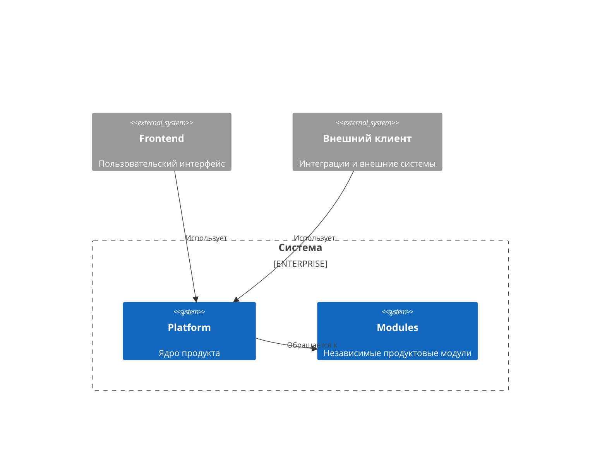
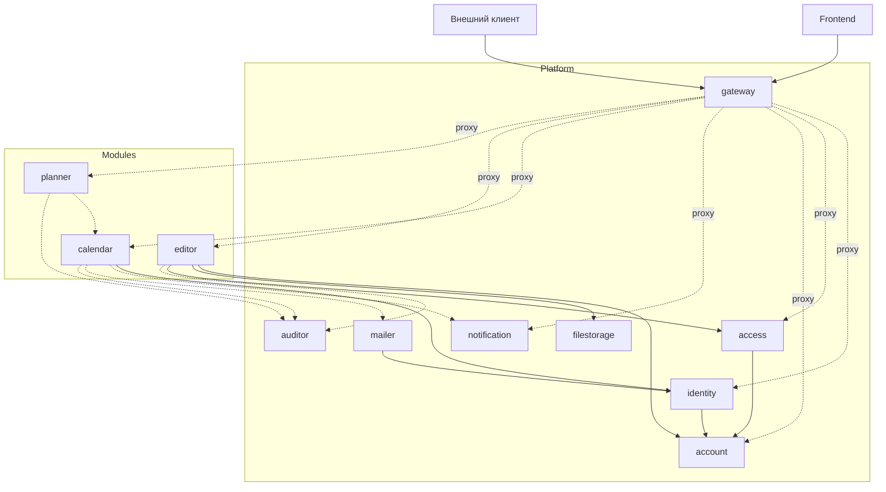
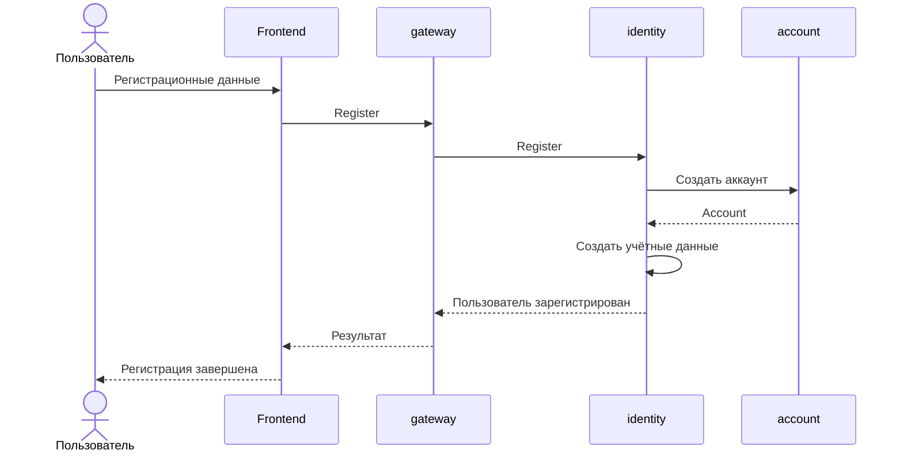
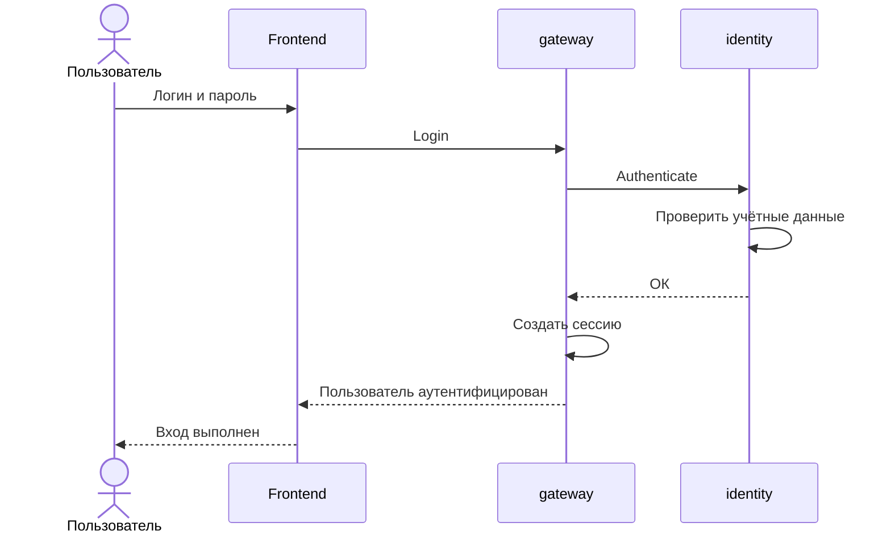
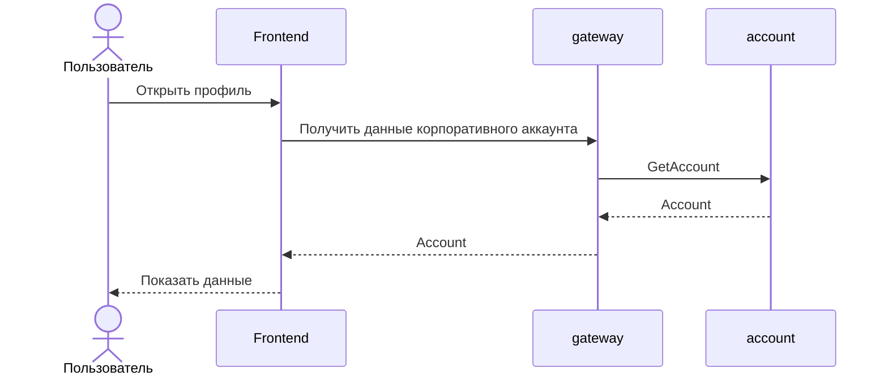
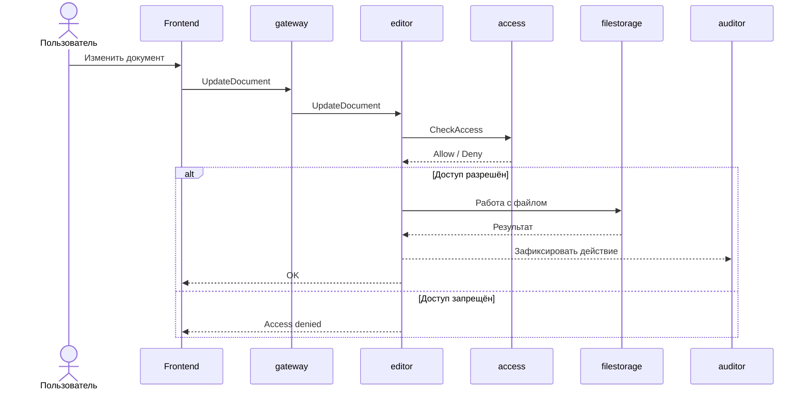
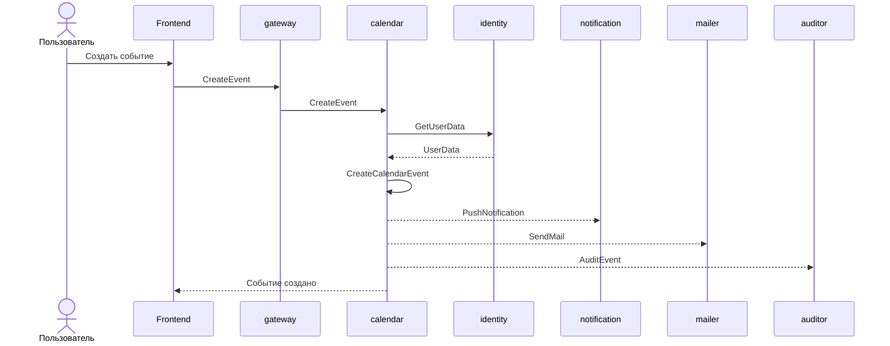
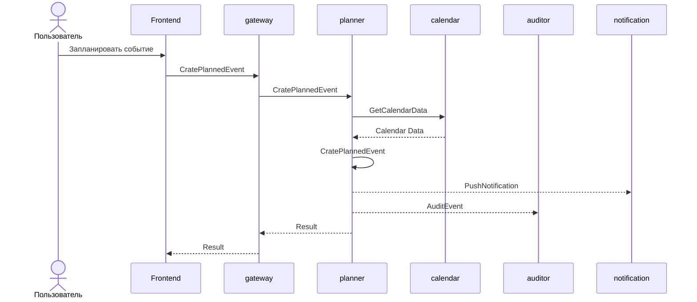

## Архитектура aura-platform

### 1. Контекстная диаграмма

### 2. Диаграмма компонентов

### 3. Описание компонентов

#### `gateway`

**Ответственность**

* единая точка входа в продукт
* принимает запросы от фронта и внешних клиентов
* направляет запрос в нужный платформенный компонент или модуль
* передаёт контекст пользователя вызываемым компонентам
* хранит в себе информацию о пользовательской сессии

**Не ответственность**

* не содержит бизнес-логику модулей
* не хранит пользовательские или продуктовые данные
* не принимает решения о бизнес-доступе к ресурсам

**Данные**

Не является владельцем бизнес-данных.

**Зависимости**

* нет

**Потребители**

* Frontend
* внешние клиенты

---

#### `identity`

**Ответственность**

* логинация пользователя
* регистрация
* управление ролями и полями пользователя
* привязка пользователя к аккаунту

**Не ответственность**

* настройки аккаунта
* права доступа к продуктовым ресурсам

**Данные**

* учётные данные

**Зависимости**

* `account`

**Потребители**

* `gateway`
* `calendar`
* `mailer`
* и другие продуктовые модули

---

#### `account`

**Ответственность**

* хранение данных корпоративного аккаунта пользователей
* управление данными аккаунта
* управление пользователями в аккаунте
* управление доступами в аккаунте

**Не ответственность**

* управление сессиями
* продуктовые данные

**Данные**

* аккаунт пользователя
* общие корпоративние данные данные

**Зависимости**

* нет

**Потребители**

* `identity`
* `gateway`
* `editor`
* `access`
* и другие продуктовые модули

---

#### `access`

**Ответственность**

* общая платформенная авторизация
* проверка возможности пользователя выполнить действие
* хранение общих правил и разрешений

**Не ответственность**

* аутентификация
* специфические бизнес-правила отдельных модулей
* хранение ресурсов модулей

**Данные**

* разрешения
* правила доступа

**Зависимости**

* `account`

**Потребители**

* `gateway`
* `editor`
* и другие продуктовые модули

---

#### `notification`

**Ответственность**

* отправка уведомлений пользователю

**Не ответственность**

* бизнес-логика конкретного модуля

**Данные**

* уведомления
* состояние доставки уведомления

**Зависимости**

* нет

**Потребители**

* `calendar`
* и другие продуктовые модули

---

#### `filestorage`

**Ответственность**

* единое хранилище файлов для модулей продукта

**Не ответственность**

* содержательная бизнес-логика документов
* правила доступа к документам
* данные аккаунта пользователя

**Данные**

* файлы

**Зависимости**

* нет

**Потребители**

* `editor`
* и другие продуктовые модули

---

#### `mailer`

**Ответственность**

* отправка электронной почты

**Не ответственность**

* принятие продуктовых решений о необходимости отправки письма
* хранение бизнес-сущностей модулей

**Данные**

* данные, необходимые для отправки и отслеживания писем

**Зависимости**

* `identity`

**Потребители**

* `calendar`
* и другие продуктовые модули

---

#### `auditor`

**Ответственность**

* сбор продуктовых событий
* формирование общего отчёта активностей модулей

**Не ответственность**

* бизнес-логика модулей
* авторизация
* изменение состояния бизнес-сущностей

**Данные**

* записи аудита
* сведения о произошедших действиях

**Зависимости**

* нет

**Потребители**

* `editor`
* `calendar`
* `planner`

---

#### `calendar`

**Ответственность**

* бизнес-логика календаря
* управление собственными календарными сущностями
* инициирование уведомлений и писем, связанных с календарными событиями

**Не ответственность**

* аутентификация пользователей
* реализация механизма уведомлений
* реализация отправки email

**Данные**

* календари
* события календаря
* данные, относящиеся исключительно к календарному модулю

**Зависимости**

* `identity`
* `notification`
* `mailer`
* `auditor`

**Потребители**

* `gateway`
* `planner`

---

#### `editor`

**Ответственность**

* бизнес-логика редактора заметок
* управление собственными документами
* использование файлового хранилища
* проверка доступа пользователя к операциям над документами

**Не ответственность**

* хранение пользовательских учётных данных
* реализация механизма авторизации
* реализация файлового хранилища
* общий аудит платформы

**Данные**

* документы
* состояние документов
* данные редактора

**Зависимости**

* `account`
* `filestorage`
* `access`
* `auditor`

**Потребители**

* `gateway`

---

#### `planner`

**Ответственность**

* бизнес-логика планирования
* управление собственными сущностями планирования
* взаимодействие с календарём в сценариях, где необходимы календарные данные

**Не ответственность**

* управление календарными сущностями
* реализация аудита
* бизнес-логика других модулей

**Данные**

* планы
* задачи и другие сущности планировщика

**Зависимости**

* `calendar`
* `auditor`

**Потребители**

* `gateway`

### 4. Карта владения данными

| Данные                         | Владелец       | Кто использует                  |
|--------------------------------|----------------|---------------------------------|
| Данные профиля пользователя    | `identity`     | `identity`                      |
| Сессия                         | `gateway`      | Все компоненты платформы        |
| Данные аккаунта                | `account`      | `identity`, `gateway`, `editor` |
| Доступы пользователя           | `access`       | `access`, `editor               |
| Уведомления                    | `notification` | `notification`, `calendar`      |
| Данные почтовика               | `mailer`       | `mailer`, `calendar`            |
| Файлы                          | `filestorage`  | `filestorage`, `editor`         |
| События продукта               | `auditor`      | `auditor`                       |
| События календаря              | `calendar`     | `calendar`, `planner`           |
| Данные календаря (чей он и тд) | `calendar`     | `calendar`                      |
| Документы/Заметки              | `editor`       | `editor`                        |
| Данные запланированных событий | `planner`      | `planner`                       |

### 5. Основные пользовательские сценарии

#### 5.1. Регистрация пользователя

---

#### 5.2. Вход пользователя

---

#### 5.3. Получение данных корпоративного аккаунта

---

#### 5.4. Работа с документом в Editor

---

#### 5.5. Работа с Calendar

---

#### 5.6. Работа Planner с Calendar

