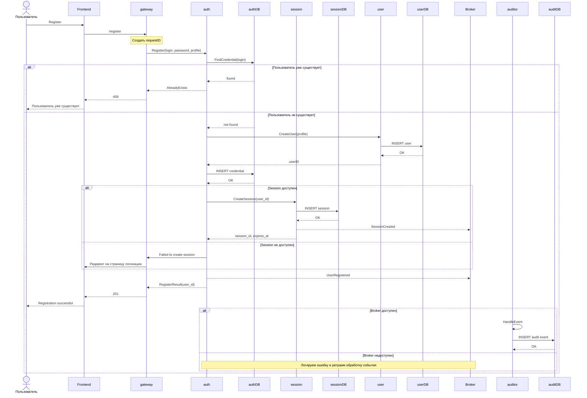
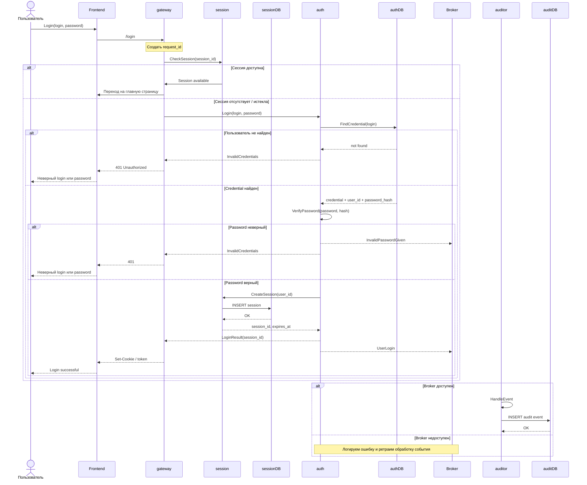
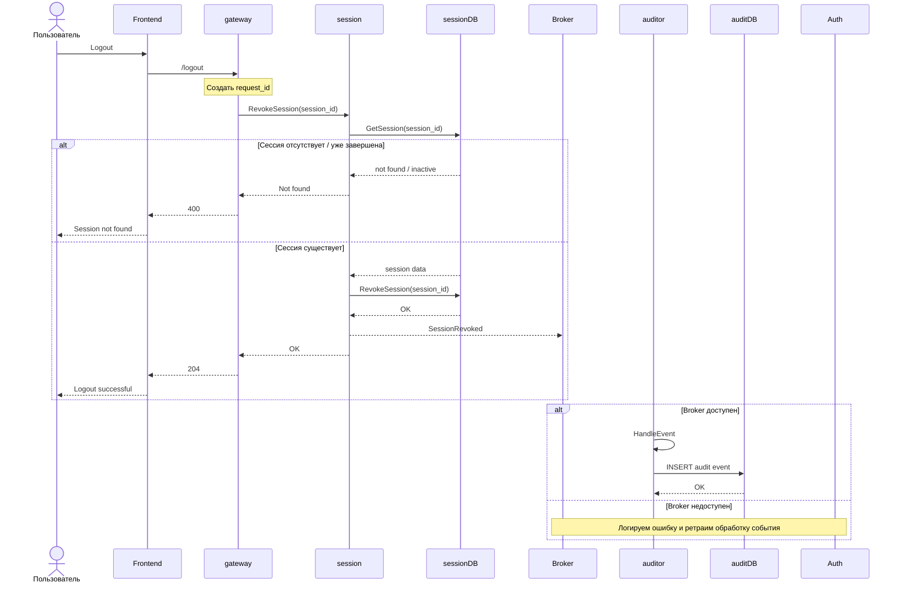
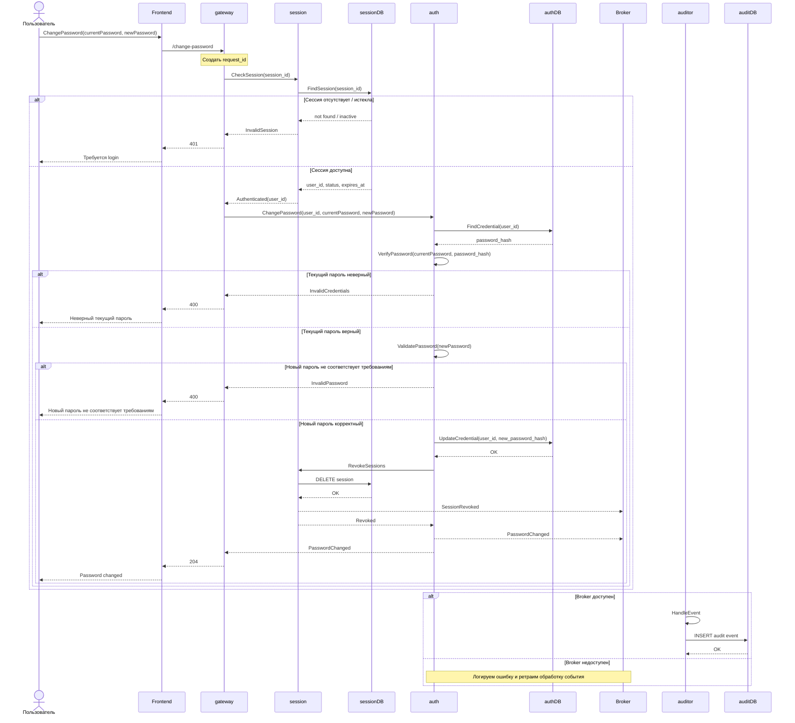

# Сценарии работы системы

## Регистрация пользователя

```mermaid
sequenceDiagram
    actor Client as Пользователь
    participant Frontend
    participant Gateway as gateway
    participant Auth as auth
    participant AuthDB as authDB
    participant Session as session
    participant SessionDB as sessionDB
    participant User as user
    participant UserDB as userDB
    participant Broker
    participant Auditor as auditor
    participant AuditDB as auditDB
    Client ->> Frontend: Register
    Frontend ->> Gateway: /register
    Note over Gateway: Создать requestID
    Gateway ->> Auth: Register(login, password, profile)
    Auth ->> AuthDB: FindCredential(login)

    alt Пользователь уже существует
        AuthDB -->> Auth: found
        Auth -->> Gateway: AlreadyExists
        Gateway -->> Frontend: 409
        Frontend -->> Client: Пользователь уже существует
    else Пользователь не существует
        AuthDB -->> Auth: not found
        Auth ->> User: CreateUser(profile)
        User ->> UserDB: INSERT user
        UserDB -->> User: OK
        User -->> Auth: userID
        Auth ->> AuthDB: INSERT credential
        AuthDB -->> Auth: OK
        alt Session доступен
            Auth ->> Session: CreateSession(user_id)
            Session ->> SessionDB: INSERT session
            SessionDB -->> Session: OK
            Session -->> Broker: SessionCreated
            Session -->> Auth: session_id, expires_at
        else Session не доступен
            Auth ->> Gateway: Failed to create session
            Gateway ->> Frontend: Редирект на страницу логинации
        end
        Auth -->> Broker: UserRegistered
        Auth -->> Gateway: RegisterResult(user_id)
        Gateway -->> Frontend: 201
        Frontend -->> Client: Registration successful

        alt Broker доступен
            Auditor ->> Auditor: HandleEvent
            Auditor ->> AuditDB: INSERT audit event
            AuditDB -->> Auditor: OK
        else Broker недоступен
            Note over Auth, Broker: Логируем ошибку и ретраим обработку события
        end

    end
```

## Логинация пользователя

```mermaid
sequenceDiagram
    actor Client as Пользователь
    participant Frontend
    participant Gateway as gateway
    participant Session as session
    participant SessionDB as sessionDB
    participant Auth as auth
    participant AuthDB as authDB
    participant Broker
    participant Auditor as auditor
    participant AuditDB as auditDB
    Client ->> Frontend: Login(login, password)
    Frontend ->> Gateway: /login
    Note over Gateway: Создать request_id
    Gateway ->> Session: CheckSession(session_id)

    alt Сессия доступна
        Session ->> Gateway: Session available
        Gateway ->> Frontend: Переход на главную страницу
    else Сессия отсутствует / истекла
        Gateway ->> Auth: Login(login, password)
        Auth ->> AuthDB: FindCredential(login)

        alt Пользователь не найден
            AuthDB -->> Auth: not found
            Auth -->> Gateway: InvalidCredentials
            Gateway -->> Frontend: 401 Unauthorized
            Frontend -->> Client: Неверный login или password

        else Credential найден
            AuthDB -->> Auth: credential + user_id + password_hash
            Auth ->> Auth: VerifyPassword(password, hash)

            alt Password неверный
                Auth -->> Broker: InvalidPasswordGiven
                Auth -->> Gateway: InvalidCredentials
                Gateway -->> Frontend: 401
                Frontend -->> Client: Неверный login или password

            else Password верный
                Auth ->> Session: CreateSession(user_id)
                Session ->> SessionDB: INSERT session
                SessionDB -->> Session: OK
                Session -->> Auth: session_id, expires_at
                Auth -->> Gateway: LoginResult(session_id)
                Auth -->> Broker: UserLogin
                Gateway -->> Frontend: Set-Cookie / token
                Frontend -->> Client: Login successful
            end
        end
    end
    alt Broker доступен
        Auditor ->> Auditor: HandleEvent
        Auditor ->> AuditDB: INSERT audit event
        AuditDB -->> Auditor: OK
    else Broker недоступен
        Note over Auth, Broker: Логируем ошибку и ретраим обработку события
    end
```

## Logout пользователя

```mermaid
sequenceDiagram
    actor Client as Пользователь
    participant Frontend
    participant Gateway as gateway
    participant Session as session
    participant SessionDB as sessionDB
    participant Broker
    participant Auditor as auditor
    participant AuditDB as auditDB
    Client ->> Frontend: Logout
    Frontend ->> Gateway: /logout
    Note over Gateway: Создать request_id
    Gateway ->> Session: RevokeSession(session_id)
    Session ->> SessionDB: GetSession(session_id)

    alt Сессия отсутствует / уже завершена
        SessionDB -->> Session: not found / inactive
        Session -->> Gateway: Not found
        Gateway -->> Frontend: 400
        Frontend -->> Client: Session not found

    else Сессия существует
        SessionDB -->> Session: session data
        Session ->> SessionDB: RevokeSession(session_id)
        SessionDB -->> Session: OK
        Session -->> Broker: SessionRevoked
        Session -->> Gateway: OK
        Gateway -->> Frontend: 204
        Frontend -->> Client: Logout successful
    end
    alt Broker доступен
        Auditor ->> Auditor: HandleEvent
        Auditor ->> AuditDB: INSERT audit event
        AuditDB -->> Auditor: OK
    else Broker недоступен
        Note over Auth, Broker: Логируем ошибку и ретраим обработку события
    end
```

## Смена пароля

```mermaid
sequenceDiagram
    actor Client as Пользователь
    participant Frontend
    participant Gateway as gateway
    participant Session as session
    participant SessionDB as sessionDB
    participant Auth as auth
    participant AuthDB as authDB
    participant Broker
    participant Auditor as auditor
    participant AuditDB as auditDB
    Client ->> Frontend: ChangePassword(currentPassword, newPassword)
    Frontend ->> Gateway: /change-password
    Note over Gateway: Создать request_id
    Gateway ->> Session: CheckSession(session_id)
    Session ->> SessionDB: FindSession(session_id)

    alt Сессия отсутствует / истекла
        SessionDB -->> Session: not found / inactive
        Session -->> Gateway: InvalidSession
        Gateway -->> Frontend: 401
        Frontend -->> Client: Требуется login

    else Сессия доступна
        SessionDB -->> Session: user_id, status, expires_at
        Session -->> Gateway: Authenticated(user_id)
        Gateway ->> Auth: ChangePassword(user_id, currentPassword, newPassword)
        Auth ->> AuthDB: FindCredential(user_id)
        AuthDB -->> Auth: password_hash
        Auth ->> Auth: VerifyPassword(currentPassword, password_hash)

        alt Текущий пароль неверный
            Auth -->> Gateway: InvalidCredentials
            Gateway -->> Frontend: 400
            Frontend -->> Client: Неверный текущий пароль

        else Текущий пароль верный
            Auth ->> Auth: ValidatePassword(newPassword)

            alt Новый пароль не соответствует требованиям
                Auth -->> Gateway: InvalidPassword
                Gateway -->> Frontend: 400
                Frontend -->> Client: Новый пароль не соответствует требованиям

            else Новый пароль корректный
                Auth ->> AuthDB: UpdateCredential(user_id, new_password_hash)
                AuthDB -->> Auth: OK
                Auth ->> Session: RevokeSessions
                Session ->> SessionDB: DELETE session 
                SessionDB -->> Session: OK
                Session -->> Broker: SessionRevoked
                Session -->> Auth: Revoked
                Auth -->> Broker: PasswordChanged
                Auth -->> Gateway: PasswordChanged
                Gateway -->> Frontend: 204
                Frontend -->> Client: Password changed
            end
        end
    end
    alt Broker доступен
        Auditor ->> Auditor: HandleEvent
        Auditor ->> AuditDB: INSERT audit event
        AuditDB -->> Auditor: OK
    else Broker недоступен
        Note over Auth, Broker: Логируем ошибку и ретраим обработку события
    end
```
